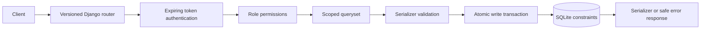

# Architecture, security and AI development notes

## Request flow

For writes, `AtomicViewSet` starts the transaction before serializer validation, so
validation queries and persistence see a consistent state. The diagram is a logical
flow; transaction boundaries enclose the validation and save steps.

## Responsibilities

- `models.py` defines normalized entities, foreign keys and database constraints.
- `serializers.py` validates requests and explicitly defines public account fields.
  Passwords are write-only; Django's password validation and PBKDF2 hashing are used.
- `views.py` applies role permissions and filters querysets before object lookup.
  Student and instructor scopes apply to list and detail endpoints. The instructor
  grade serializer additionally checks the enrollment referenced in POST/PATCH data.
- `filters.py` provides documented `_id` query parameters and allowlisted sorting.
  A primary-key tie breaker keeps equal-valued rows stable across pages.
- `api_support.py` bounds list sizes and translates errors without exposing SQL,
  exception text, stack traces or credentials.
- `authentication.py` checks database-backed token expiration and current account
  status on every authenticated request.

## Design decisions

**SQLite for local reproducibility.** No separate database service is needed. API
writes use SQLite IMMEDIATE transactions, acquiring the writer lock before capacity
checks. Database constraints also protect duplicate enrollments under races. SQLite
can return a retryable 503 under contention. A concurrency test verifies that two
requests cannot occupy one available seat. Moving to PostgreSQL needs an explicit
row-lock strategy around offering capacity, in addition to changing database settings.

**Explicit roles.** The four required roles are stored as choices on the custom user.
Administrative API access depends on `role=ADMIN`, not client-supplied staff flags.
Only administrators can link student accounts to profiles. This prevents a registrar
from granting a login access to a different student's records by changing `user_id`.

**Privacy through scoped resources.** Students see only their own student, enrollment
and grade objects. Cross-student IDs return 404. Instructors use their own offering
rosters and scoped enrollment/grade collections. They cannot retrieve complete
student profiles or transcripts. Rosters omit birth dates and contact information.

**Token lifecycle.** One DRF token per user is reused while valid; expired tokens are
replaced on successful password login. Logout, password changes and deactivation
invalidate tokens. Login ignores any stale Authorization header. Django authentication
performs a dummy password hash for unknown accounts; invalid and inactive accounts
receive the same message. Tokens are stored using DRF's standard database token model,
so database access must be protected. This local implementation does not provide
refresh tokens or per-device sessions.

**Academic integrity.** Grades use a documented 0-100 scale. DRAFT may have missing
ratings; FINALIZED requires a final rating. A grade cannot move between enrollments;
graded enrollments cannot be dropped. Enrollment links and an enrolled offering's
course/term cannot be rewritten. Referenced deletes return 409; status fields support
deactivation while preserving history. These are laboratory rules, not a claim to
match a specific institution's grading policy.

**Bounded academic records.** Transcript pages contain at most 100 enrollment rows,
grouped by term within the page. A term can continue on the next page. Clients merge
term groups by term ID after following `data.pagination.next`.

**Response conventions.** Resource CRUD uses native DRF object/list shapes. Login,
current-user and academic-record actions use explicit envelopes. This distinction is
documented in the live OpenAPI contract. Every API failure uses the same error envelope.

## Operational limits

Debug defaults to false. CORS access is not enabled. Production mode requires HTTPS
and disables demo seeding; a production server, protected database backups, monitoring
and a shared throttle cache still need to be configured for deployment. The default
login throttle is local-process protection, not a distributed abuse-prevention system.

## AI contribution and review

AI generated the schema, serializers, viewsets, tests, seed command and documentation.
The continuation audit found defects that the initial 42 tests missed: nested academic
data exposure, unbounded action lists, a mismatched filter parameter, stale-token login,
and grade creation on repeated seeding. Fixes have targeted regression tests. An
additional concurrency test covers the capacity rule. The HTTP collection exercises
success and error paths independently of Django's in-process test client.

The commits represent actual work stages. They do not claim that a human has reviewed
or understood the implementation. Before submitting, the student should trace one
enrollment request through permission, validation, transaction and database constraint;
explain why hiding an ID in the client is insufficient; and demonstrate a small
validated change with its tests.

Framework references used during implementation:
[DRF permissions](https://www.django-rest-framework.org/api-guide/permissions/),
[authentication](https://www.django-rest-framework.org/api-guide/authentication/),
[filtering](https://www.django-rest-framework.org/api-guide/filtering/), and
[drf-spectacular customization](https://drf-spectacular.readthedocs.io/en/latest/customization.html).
