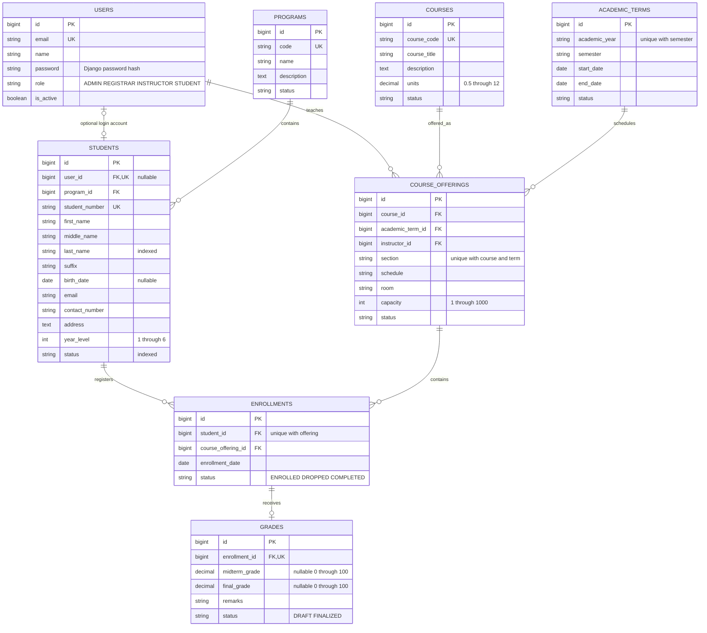

# Entity relationship diagram

All eight domain entities have `created_at` and `updated_at`; the diagram omits repeated
timestamps for readability. Django adds its own authentication tables and
`authtoken_token` (one token per user). Actual domain table names have the `academics_`
prefix. The authoritative schema is `academics/migrations/0001_initial.py`.

Domain foreign keys use `PROTECT`: deletion of referenced records returns 409. Unique
constraints prevent duplicate student numbers, course/program codes, user emails,
term/semester combinations, offering sections, enrollments and grades. Check constraints
enforce grade/unit/capacity/year ranges, ordered dates and finalized-grade completeness.
Foreign keys are indexed by Django; student last name and status have explicit indexes.

The user-to-student relationship is optional on both sides. Only an administrator can
link a STUDENT account to a profile. An offering's instructor must be an active
INSTRUCTOR account; that cross-table rule is checked by the API.
