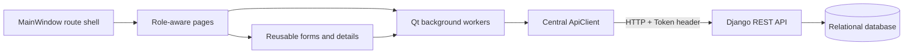

# Frontend architecture

`MainWindow` is the application router. Login is public; successful authentication
replaces it with a protected shell and a `QStackedWidget`. Navigation keys are an
explicit route table built from the backend role. A missing route renders a not-found
state. A 401 clears the in-memory session and returns to login. A 403 stays on the
current page with an access-denied state.

`ResourcePage` renders backend collections using a `Resource` definition. It owns
temporary query state (search, filters, sorting, page), displays server pagination,
and refreshes after mutations. A generation counter discards stale list responses.
`ResourceDialog` builds structured forms and populates foreign-key selectors from live
API lists. Immediate required/email checks improve usability; backend 422 data is the
authoritative result and maps back to named fields without closing the form.

`ApiClient` is the only HTTP boundary. It joins the environment-configured base URL,
sets the token header, handles empty 204 responses, normalizes 400/401/403/404/409/422/
429/500+ responses, and converts timeout/connection failures to an actionable network
error. The token and user exist only in process memory. Restarting the app requires
login, reducing credential persistence on shared laboratory computers.

Potentially slow HTTP work runs through `ApiWorker` on Qt's global thread pool. Signals
return results and errors to the GUI thread, so the window continues to repaint and
indeterminate progress bars remain visible. The requests session is used for one active
page operation at a time in normal interaction; dashboard counts execute sequentially
inside one worker.

The desktop layout uses a navigation sidebar, consistent content cards, readable
tables, labels and status text. Below 900 pixels the sidebar narrows; resource controls
stack vertically below 760 pixels and secondary table controls are reduced. Status is
communicated in text in addition to color. Controls have accessible names/tooltips and
normal Qt keyboard focus behavior.

The UI never imports Django, SQLite, a database driver, backend models, or backend
configuration. The test suite may launch the backend as an external process for an
end-to-end integration test, but production frontend code communicates only over HTTP.
