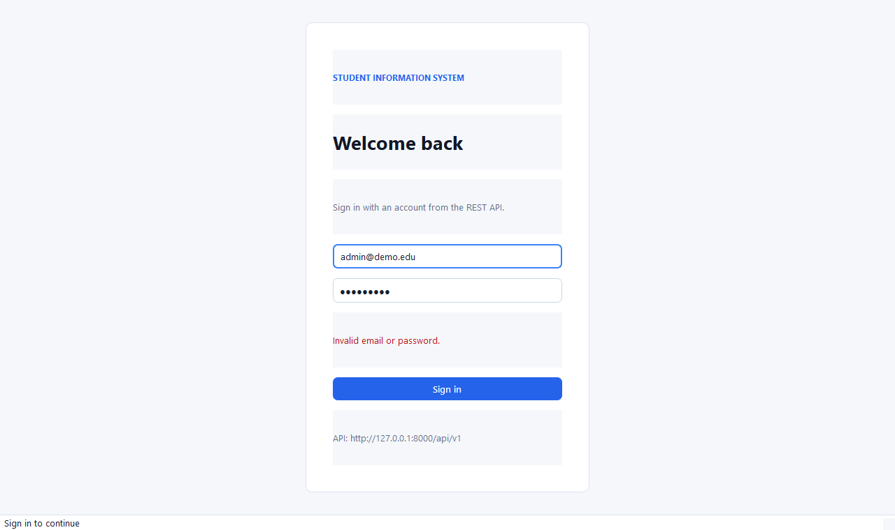
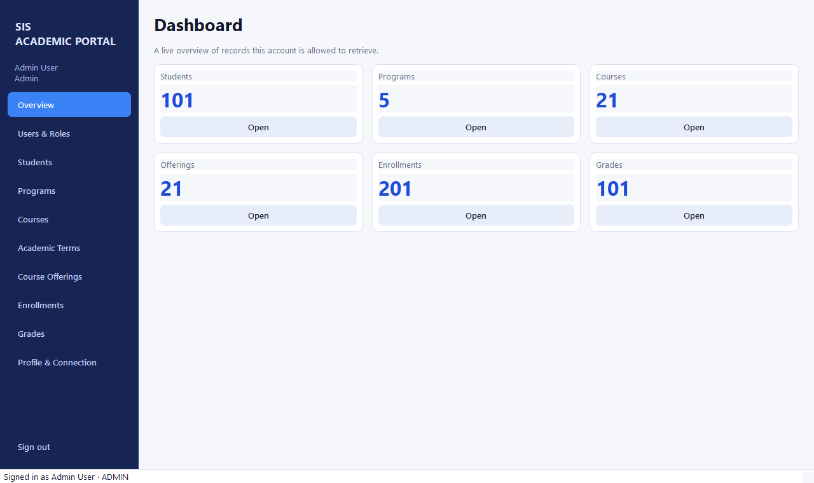
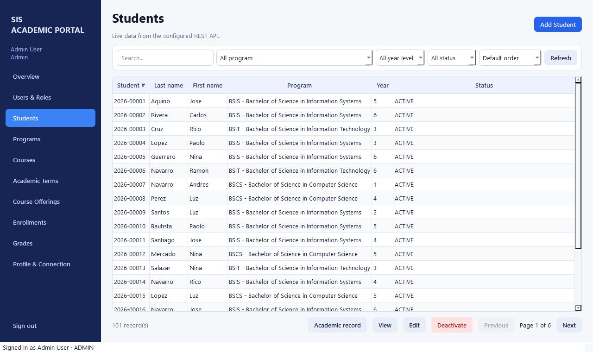
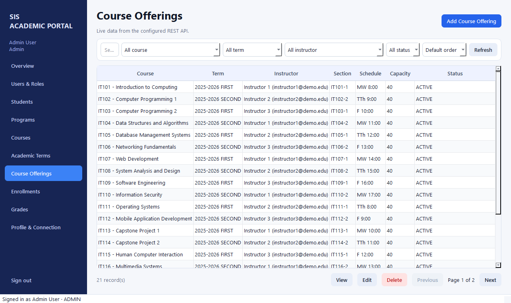
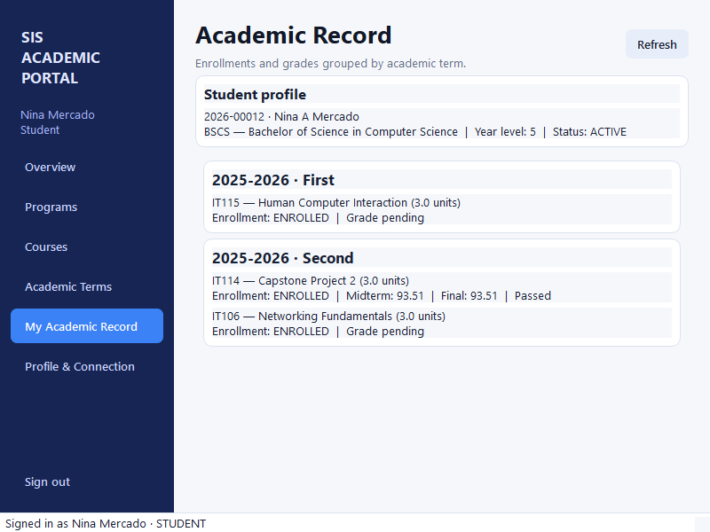
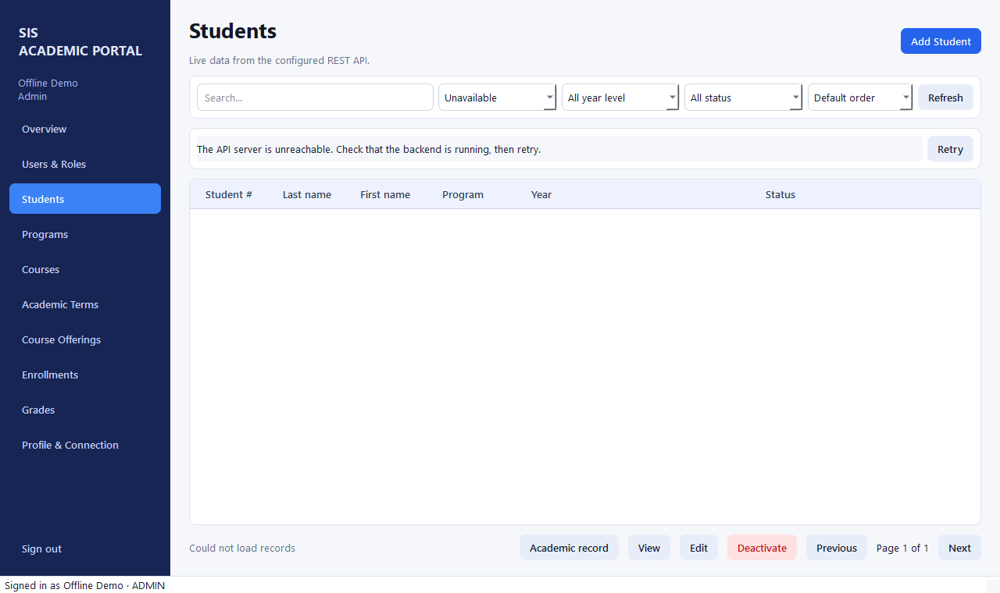

# Screenshot evidence

These images were captured by `scripts/capture_screenshots.py` from the PyQt6 client
while it was connected over HTTP to the seeded Django backend. The capture script reads
the demo password from a process environment variable and does not print or save it.

## Invalid login

## Administrator dashboard

## Backend-driven students list

## Course offerings module

## Student academic record at a narrow window size

## Controlled backend-unavailable state

The screenshot dataset is evidence from one local run, not application data. Core
records continue to be loaded live whenever the frontend runs.
